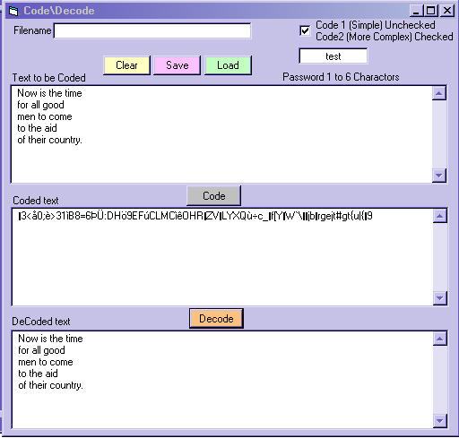



## EncodeDecode \(updated\)

### Description

I could'nt find an encoder program that would save and load more than one line of text, and actually work,so I threw this together.I modified the program EnDeCode by Joshua Larsen and made this program.
 
### More Info
 

             |
---                |---
**Submitted On**   |2003-06-19 17:04:32
**By**             |[Kenneth Foster](https://github.com/Planet-Source-Code/PSCIndex/blob/master/ByAuthor/kenneth-foster.md)
**Level**          |Beginner
**User Rating**    |4.6 (32 globes from 7 users)
**Compatibility**  |VB 6\.0
**Category**       |[Complete Applications](https://github.com/Planet-Source-Code/PSCIndex/blob/master/ByCategory/complete-applications__1-27.md)
**World**          |[Visual Basic](https://github.com/Planet-Source-Code/PSCIndex/blob/master/ByWorld/visual-basic.md)
**Archive File**   |[EncodeDeco1603296192003\.zip](https://github.com/Planet-Source-Code/kenneth-foster-encodedecode-updated__1-46253/archive/master.zip)

